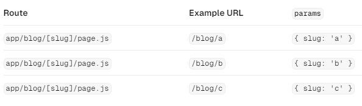

## ✏️ 파일의 트리구조 설명

!

- 트리(Tree) : 계층 구조를 시각화 하기 위한 규칙
- 루트(Root) : 각 트리를 기준으로 했을 때 첫번재 노드
- 리프(Leaf) : 더 이상 자식이 없는 트리의 마지막 노드

## ✏️ URL 구조 설명

[alt text](image-3.png)

- 세그먼트(Segment) : 슬래시로 구분된 URL 경로의 일부
- 경로(path) : 도메인 뒤에 오는 URL의 일부 (세그먼트로 구성)
