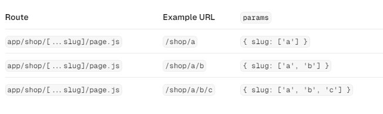
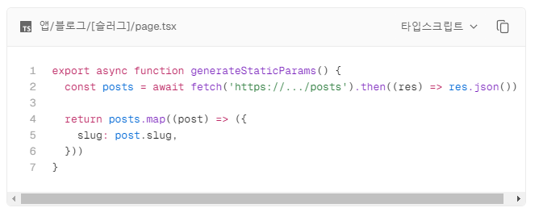

## ✏️ 필기

페이지를 미리 만들고 싶다면 **동적 라우팅 파일**에서
generateStaticParams() 라는 함수를 사용한다.
이는 Next.js가 제공하는 함수다. (이름 고정임!)

**generateStaticParams() 함수 정의하기**

1. 현재 트리의 루트(폴더명)에 해당하는 이름으로 배열을 만든다.
2. 배열에 미리 보여줄 slug 값들을 저장한다.
3. [{slug: "superman"}, {slug:"batman"}, ...] 형태로 만들어서 return한다.

## ⌨️ 코드 예시

```ts
type Props = {
  params: {
    slug: string;
  };
};

export default function HerosPage({ params }: Props) {
  return <div>{params.slug}</div>;
}

export function generateStaticParams() {
  const heros = ["superman", "batman"]; // hero/superman or hero/batman 페이지로 이동하면 정적 페이지를 보여준다.

  return heros.map((hero) => ({
    slug: hero,
  }));
}
```

**slug에 하나의 값만 입력되었을 때**  


**slug에 두개 이상의 값이 입력되야 할 때**  
[...slug] 이렇게 사용하면 된다.  


## 🤔 개인적으로 아래 코드가 더 직관적인거 같은데 공식문서에는 필기 내용대로 나와있다.

**공식문서대로 하는게 맞겠지?**

**내가 생각하는 직관적인 generateStaticParams()**

```ts
export function generateStaticParams() {
  const heros = ["superman", "batman"]; // hero/superman or hero/batman 페이지로 이동하면 정적 페이지를 보여준다.
  const params = heros.map((hero) => ({
    slug: hero,
  }));
  return params;
}
```

**공식문서 generateStaticParams()**  


## 🤔 정적페이지 보여주는건 알겠어 근데 그 정적페이지는 어디다 만듬?

## 🤔 지금 이 HeroPage에서 superman과 batman이게 다 만든건가?
