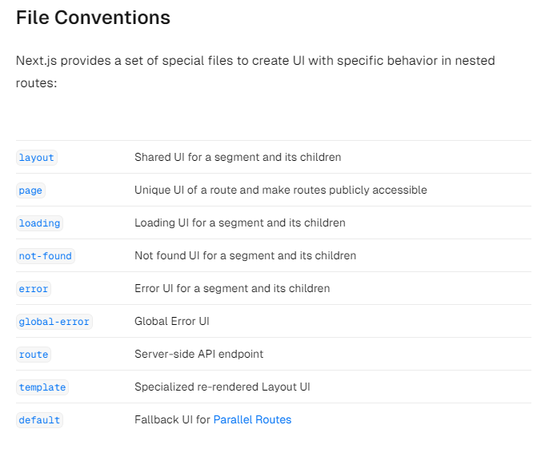

## ✏️ 필기

음.. not-found.tsx 파일을 만들고 아래와 같이 코드를 입력한다.  
중요한건 파일명이야. 코드는 아무래도 상관없는듯, 컴포넌트이름이이라던지 말이야  
  
이 파일 컨벤션을 보면 not-found 라는 이름의 파일을 사용해야해

```ts
import Link from "next/link";

export default function NotFound() {
  return (
    <div>
      <h2>Not Found</h2>
      <p>Could not find requested resource</p>
      <Link href="/">Return Home</Link>
    </div>
  );
}
```

## 🤔 [slug]에서 notfound는 어떻게 하는걸까?

일단 아래와 같이 해줬다.  
조건문을 사용해서 동적 라우팅에서도 notfound를 사용할 수는 있는데 이게 올바른 사용법인지 확실하지는 않다.  
다만 notFound() 라는 함수를 호출하는 것은 확실하다.

```ts
export default function HeroPage({ params }: Props) {
  if (params.slug !== "superman" && params.slug !== "batman") {
    notFound();
  }
  return <div>{params.slug}</div>;
}
```
