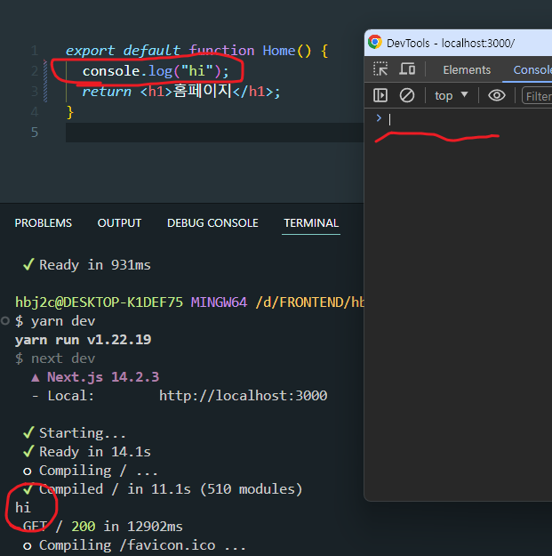

## ✏️필기

App 폴더 내의 컴포넌트들은 기본적으로 서버 컴포넌트다.

위 사진처럼 터미널에는 console.log()가 출력되는데
개발자도구에는 출력되지 않는다.

따라서 서버 컴포넌트는 서버에서 실행된다는 것을 확인할 수 있다.  
HTML로 전송되기 떄문에 console.log()는 실행되지 않는구나!  
브라우저에서 제공하는 API 사용불가, 노드 API 사용 가능

## ⭐ 요약

1. 서버 컴포넌트는 서버에서 실행된다.
2. 이렇게 서버 컴포넌트로 실행된 코드는 HTML 형태로 클라이언트에게 전송된다.
3. 그래서 console.log() 같은 브라우저 APIs는 사용할 수 없다.
4. 대신 노드 API 사용 가능하다.
