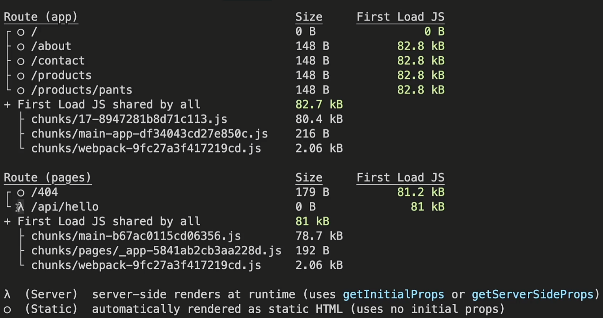

# 🤔 dev와 build는 언제 사용하는가?

프로젝트를 진행 할 때는 yarn dev로 웹사이트를 확인하면서 한다.

이후 배포할 때 yarn build로 빌드를 진행하고,
yarn start로 웹사이트를 확인한다.

# 🤔 dev와 build 각각 웹사이트는 어떤 차이가 있는가?

dev : 개발자모드라서 SSG라도 그때그때 새로 만든다. 그래서 살짝 로딩이 걸린다.

build->yarn : build를 했으므로 이 과정에서 SSG 페이지들은 미리 만들어진다. 그래서 로딩시간이 거의 없다.

# build를 했을 때 콘솔창에서 볼 수 있는 정보들

